# Bio background (DRAFT, distilled for a non-biologist)

- Plain-language version
- Fully cited version is in git history (commit c1c684b)
- Anything marked (unverified) came from a search summary and was not checked against the paper

## The fly brain in one minute

- Size
  - About 140k neurons in the brain
  - Another ~20k in the ventral nerve cord (VNC)
    - The VNC is the fly's spinal cord
    - It runs the legs and wings
    - We drop it, since a gridworld has no legs
- Two brain regions matter for us
  - Optic lobes
    - Two big visual processing blocks, one per eye
    - About 60% of all brain neurons live here
  - Central brain
    - Everything else: smell, taste, memory, navigation, internal state
    - Also holds the command neurons that tell the body what to do
- A connectome is a wiring diagram
  - For every neuron: which other neurons it connects to, and with how many synapses
  - A synapse is a contact point where one neuron pushes on another
    - More synapses between a pair means a stronger connection
  - Each neuron releases one main chemical, its neurotransmitter
    - The chemical decides whether the neuron excites (pushes up) or inhibits (pushes down) its targets
    - Excitatory: acetylcholine
    - Inhibitory: GABA, glutamate, histamine
    - Neuromodulators: dopamine, serotonin, octopamine
      - Change how circuits behave over seconds to minutes
      - Our model cannot represent this
      - Under 1% of neurons, so a small loss

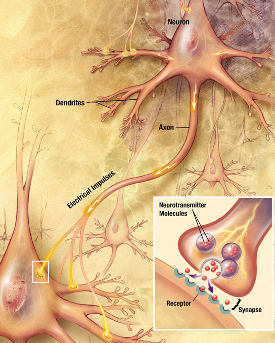

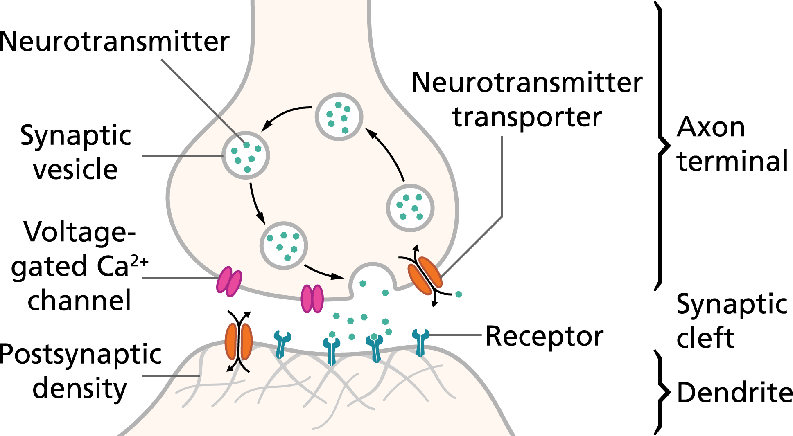

- How the pictures map to our model
  - The spike travelling down the axon is our binary $s_j = 1$
  - The 1.8 ms axon delay is the travel time down that axon
  - Neurotransmitter release plus receptor binding is collapsed into one number: add $w_{ji}$ to the target's $g_i$
  - The sign of $w_{ji}$ is decided by which neurotransmitter the sending neuron uses
  - The number of synapses between the pair (there can be dozens) is the magnitude
  - Sources: Wikimedia Commons "Chemical synapse schema"; Queensland Brain Institute, brain-basics pages
- Descending neurons (DNs)
  - The ~1,300 neurons whose axons leave the brain and go down into the VNC
  - The brain's only way of commanding movement
  - Everything the fly does physically is expressed as a pattern of DN activity

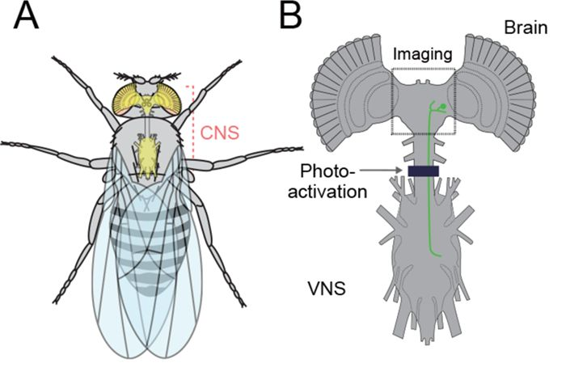

- Reading the figure (Namiki et al. 2018, eLife, Fig 1)
  - Panel A: where the CNS sits in the body, brain in the head, VNC in the thorax
  - Panel B: the schematic we care about, the two fan-shaped optic lobes flanking the central brain, the neck connective, and the VNC below
  - Panels E, F: two real descending neurons in green (DNp01, DNp02), cell body in the brain, one long axon running down the whole VNC
  - We keep everything above the neck connective and cut everything below
- Cell types
  - A named group of neurons with the same shape and wiring
  - Usually a mirrored left/right pair or a small population
  - Names like DNp09 or MDN are cell types
  - The connectome data labels every neuron with its type, which is how we find them

## How the wiring diagram becomes a running brain

- This is the Shiu et al. 2024 recipe we are copying
- Full details in `brain_model.md`

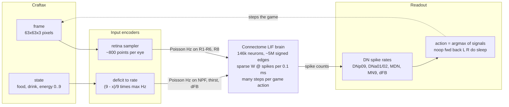

- Zero-shot loop. The trained variant swaps the readout for a linear layer over all 1,314 DNs

### One neuron

- Each neuron is a single number: its voltage $v$
  - Leaks toward a rest value of -52 mV
  - When it crosses -45 mV it "spikes"
  - After a spike: resets to -52 mV, frozen for 2.2 ms
- Each neuron also has an input accumulator $g$
  - Decays with a 5 ms time constant
  - A spike from neuron $j$ adds $w_{ji}$ to the $g$ of every target $i$
  - The addition lands 1.8 ms after the spike (axon delay)

$$
\begin{aligned}
\frac{dv_i}{dt} &= \frac{g_i - (v_i - v_{\text{rest}})}{20\ \text{ms}} \\
\frac{dg_i}{dt} &= -\frac{g_i}{5\ \text{ms}} \\
g_i &\leftarrow g_i + w_{ji} \quad \text{when } j \text{ spikes}
\end{aligned}
$$

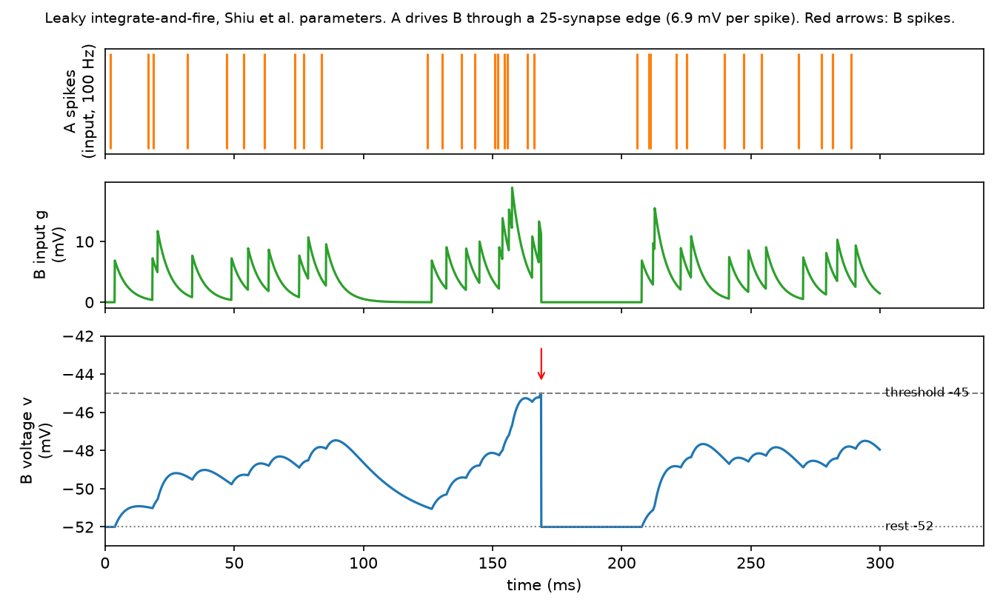

- Reading the trace
  - Each input spike adds 6.9 mV to $g$, which then decays over ~5 ms
  - $v$ integrates $g$ slowly (20 ms) so a single spike is not enough
  - Two spikes close together push $v$ over -45 mV, it fires once, resets, and sits frozen for 2.2 ms
  - Even a strong edge driven at 100 Hz fires the target only once in 300 ms
    - This is why the whole brain is quiet unless driven hard
  - Generated by `img/make_diagrams.py`, so the parameters can be changed and re-run

### Weights

- The weight is just the connectome
  - $w_{ji} = s_j \cdot n_{ji} \cdot 0.275\ \text{mV}$
  - $n_{ji}$ is the synapse count from $j$ to $i$
  - $s_j = \pm 1$ is the sign of the sending neuron's neurotransmitter
  - 0.275 mV is the one free constant in the whole model
- Scale intuition
  - Gap from rest to threshold is 7 mV
  - So about 25 simultaneous synapses fire a resting neuron

### The whole brain

- Not a layered network
  - An MLP is a chain of layers, each with its own weight matrix
  - A brain has no layers: any neuron can connect to any other, including loops back
  - So we use one adjacency matrix $W$ over all 146k neurons
    - $W_{ij}$ is the weight from neuron $j$ (column) to neuron $i$ (row)
    - Zero when not connected, which is 99.99% of entries
    - A few million non-zeros total
  - Closest ML analogy: an RNN with a fixed, untrained weight matrix
    - Hidden state is $(v, g)$ per neuron
    - Run for thousands of timesteps, not one forward pass

- Toy example, 4 neurons
  - A excites B (3 synapses) and C (2 synapses)
  - B excites D (4 synapses), C inhibits D (5 synapses)
  - Suppose only A spiked this step

$$
W = \begin{pmatrix}
0 & 0 & 0 & 0 \\
3 & 0 & 0 & 0 \\
2 & 0 & 0 & 0 \\
0 & 4 & -5 & 0
\end{pmatrix},
\qquad
s = \begin{pmatrix} 1 \\ 0 \\ 0 \\ 0 \end{pmatrix},
\qquad
W s = \begin{pmatrix} 0 \\ 3 \\ 2 \\ 0 \end{pmatrix}
$$

- Reading the toy example
  - B receives +3, C receives +2, D receives nothing this step
  - If B and C later spike together, D receives $4 - 5 = -1$
    - C's inhibition only matters because B is also active
    - If B were silent, D would sit at zero regardless of C

- One timestep, for real
  - $s_t$ is the spike vector: 1 where a neuron fired this step, else 0
    - Almost all zeros, typically a few hundred ones out of 146k
  - $W s_{t-18}$ is the incoming input to every neuron
    - Row $i$ sums the weights from neurons that spiked 18 steps ago
    - 18 steps is the 1.8 ms axon delay at $dt = 0.1$ ms
    - Zero for most neurons, since none of their partners fired
  - Driven neurons (photoreceptors, hunger cells) bypass all this: we simply set $s_t = 1$ with probability rate times $dt$

$$
\begin{aligned}
\text{in}_t &= W\, s_{t-18} \\
v_t &= v_{\text{rest}} + b\,(v_{t-1} - v_{\text{rest}}) + c\, g_{t-1} \\
g_t &= a\, g_{t-1} + \text{in}_t \\
s_t &= \big[\, v_t > v_{\text{th}} \,\big] \\
v_t, g_t &\leftarrow v_{\text{rest}},\ 0 \quad \text{where } s_t = 1
\end{aligned}
$$

- Reading the update
  - $a = e^{-dt/5}$, $b = e^{-dt/20}$, $c = (b - a)/3$ are three constants from the time constants
  - Everything except $W s$ is elementwise, so the sparse matvec is the whole cost

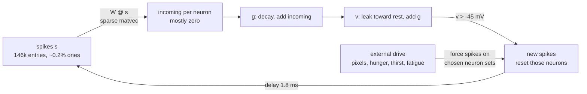

- There is no background activity
  - Nothing fires unless we drive it
  - Inhibition therefore has no effect on a silent neuron (see D in the toy example)

### Input and output

- Input means: pick a set of neurons and make them fire randomly at a chosen rate
  - Poisson spikes at, say, 100 Hz
  - The paper's whole input vocabulary is "this cell type at this many Hz"
- Output means: count spikes of a chosen set over a time window, convert to Hz
- Every I/O channel below is implemented the same way
  - Input channel: a fixed list of neuron indices, plus a rate we set from the game state
  - Output channel: a fixed list of neuron indices whose spike count we read

## Vision: pixels in

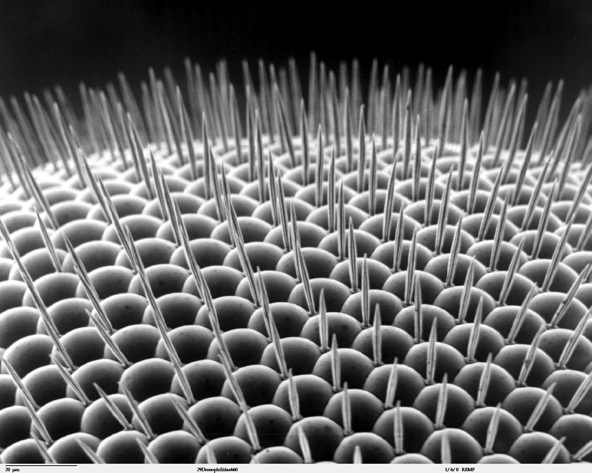

- Each dome is one ommatidium, one pixel of the fly's image (Louisa Howard, Dartmouth, public domain)

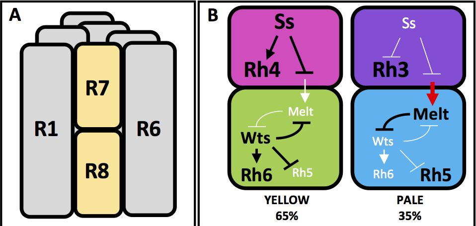

- Reading the figure (Wells et al. 2017, eLife, Fig 1)
  - Panel A: the 8 photoreceptors inside one ommatidium, seen end-on. R1 to R6 form the outer ring, R7 sits on top of R8 in the centre
  - Panel B: two ommatidium flavours, yellow (65%) and pale (35%), set by which opsins (Rh3 to Rh6) R7 and R8 express
    - Our dataset labels R7 and R8 by this flavour: R7y, R7p, R8y, R8p
  - Panels C, D are about developmental signalling, ignore

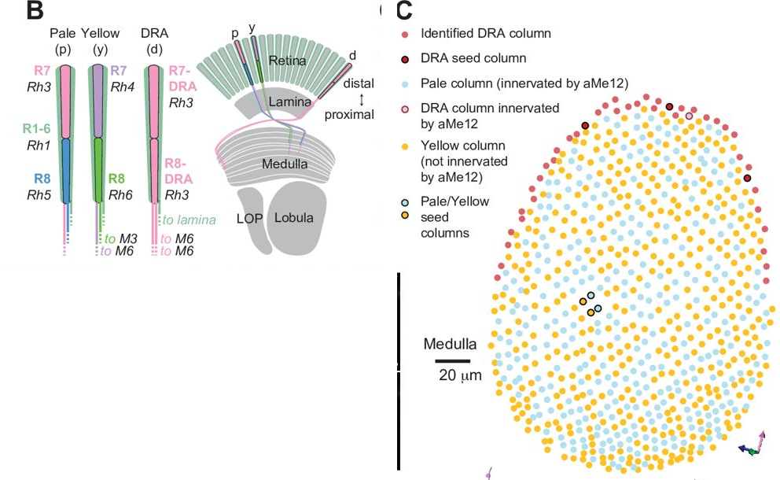

- Reading the figure (Kind et al. 2021, eLife, Fig 1)
  - Panel B, left: the three ommatidium types drawn as columns, with which opsin each cell carries
  - Panel B, right: where the axons go. R1-R6 (green) stop in the lamina. R7 and R8 pass through and end in the medulla at different depths
  - Panel C: the medulla seen face-on, one dot per column, about 800 per eye. This is the hex grid our retina sampler has to map pixels onto
    - Blue dots are pale columns, yellow are yellow, red is the dorsal rim (polarisation vision, not useful to us)
  - Panels D to H are connectivity detail, ignore

- Eye structure
  - Each eye is a hexagonal grid of about 800 little lenses (ommatidia)
  - Behind each lens sit 8 photoreceptor cells
    - R1-R6: six cells that respond to overall brightness
      - Feed the motion-detection pathway
      - Think of them as a greyscale camera
    - R7 and R8: two cells sensitive to specific colours
      - R7 sees UV
      - R8 sees blue or green
      - Colour vision comes from comparing R7 against R8, not from R8 alone
- Sign
  - All photoreceptors are inhibitory (histamine)
  - Light makes them fire, and their firing suppresses the next layer
  - The sign flips again downstream
  - Normal, and handled automatically by the connectome signs
- What the data has
  - R1-R6 is one pooled label (3,377 cells)
  - R7 and R8 are split into pale / yellow / dorsal-rim subtypes
  - Photoreceptors carry no eye-position coordinates
    - We must infer which lens each one belongs to from what it connects to
- Mapping for us
  - Pixel brightness drives R1-R6
  - Pixel colour drives R8
  - Using R8 alone for colour is a simplification
- Implementation sketch
  - Sample the game frame at ~800 points per eye, one per lens
  - Brightness at a point sets the Poisson rate of that lens's R1-R6 cells
    - Roughly rate = brightness times some max Hz
  - Colour sets the R8 rate the same way
  - Which pixels map to which lens is the retina geometry decision, still open

## Internal state: hunger, thirst, fatigue in

- These are the "how am I feeling" signals
  - In a real fly they come from body sensors we do not have
  - So we inject them directly into brain neurons that normally carry the signal
- Implementation sketch
  - Craftax exposes food, drink, energy as integers 0 to 9
    - Plus smooth float accumulators if we want a continuous signal
  - Map deficit to a rate
    - e.g. hunger rate = (9 - food) / 9 times max Hz
  - Drive the chosen cell type at that rate
  - Three scalars in, three small neuron sets driven

### Hunger

- NPF neurons
  - Release a peptide (neuropeptide F) that acts as a hunger broadcast
  - Activating them in a fed fly makes it behave as if starved (Krashes 2009)
    - Chases food cues
    - Accepts worse food
- Catch
  - NPF works by slowly releasing a chemical into the surroundings, not by fast synapses
  - Our model only does fast synapses
  - So we are using NPF's wiring as a proxy for its real effect
- What the data has
  - Only 2 NPF neurons (plus 2 related DNs)
  - Hunger through NPF is a 2-cell channel
- Alternatives if 2 cells is too thin
  - Sugar-taste neurons
    - Fast "I am touching food" signal, not a hunger state
  - AKH-responsive neurons
    - 4 cells
    - Promote sugar intake and suppress water intake
    - So they mix hunger and thirst

### Thirst

- ppk28 neurons
  - Water-taste sensors on the mouthparts and legs
  - Activating them makes a fly extend its proboscis and drink, even with no water present (Cameron 2010)
- ISNs
  - 2 neurons in the mouth region (SEZ)
  - Sense blood osmolality, the fly's actual "am I dehydrated" sensor
  - Inhibited when dehydrated, which promotes drinking
- What the data has
  - No ppk28 or water label at all
  - Only 275 head taste neurons survive the VNC cut
    - Labelled by body part, not by what they taste
  - Nearest proxies
    - Humidity-sensing neurons (66 cells)
    - A hand-picked mouthpart taste type

### Fatigue and sleep

- Flies sleep
  - Sleep pressure builds while awake
  - Tracked by a circuit in the central complex, the fly's navigation and state hub

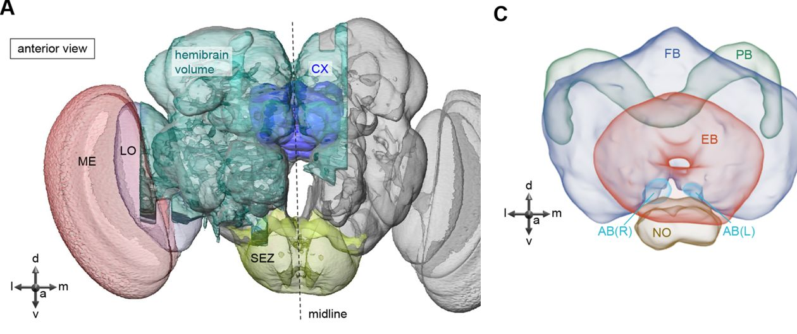

- Reading the figure (Hulse et al. 2021, eLife, Fig 1)
  - Panel A: the central complex (CX, blue) sits dead centre in the brain, between the two optic lobes (ME, LO in red)
  - Panel C: the four parts. EB (ellipsoid body, red ring) is where the ER5 sleep counter lives. FB (fan-shaped body, blue) is the layered structure whose top layers are the "dFB"
    - The glossary table has a typo, "BU" in the third table should read FB
  - The CX is also the fly's compass and navigation hub, which is why DNa02 steering takes input from here
- dFB neurons (dorsal fan-shaped body)
  - The textbook sleep switch: activate them and the fly sleeps (Donlea 2011, 2014)
  - Sleep here is a state, not a movement
    - This is why the spec maps sleep to dFB activity rather than to a DN
- Catch
  - In 2023 the classic dFB experiments were shown to be contaminated by unrelated VNC neurons in the same genetic tool (De 2023)
  - A 2025 follow-up says dFB does still promote sleep but needs stronger drive than thought (Jones 2025)
  - The link survives but is weaker than the textbooks say
- ER5 (also called R5) ring neurons
  - In the ellipsoid body, upstream of dFB
  - The sleep-pressure counter: firing rises with time awake
  - Better characterised than dFB
- What the data has
  - No "dFB" label
  - The dorsal fan-shaped body layers are FB6 and FB7
    - 140 neurons across 43 types
    - The data does not say which of them are the sleep ones
  - ER5 exists as a clean 21-neuron type

## Movement: actions out

- The fly cannot move directly from the brain
  - It sets DN activity
  - The VNC turns that into leg movements
  - We skip the VNC and read DN activity as the action
- Forward: DNp09
  - Activating it makes the fly walk forward
  - Slight bias toward turning to the same side
  - Also used in courtship chasing (Bidaye 2020)
- Turn: DNa02 and DNa01
  - Each side's neuron drives a turn toward that side
  - Left-minus-right firing predicts how fast the fly rotates
  - DNa02
    - Quick turns
    - Direct input from the heading-versus-goal comparison in the navigation hub
  - DNa01
    - Slower, sustained turns (Rayshubskiy 2024)
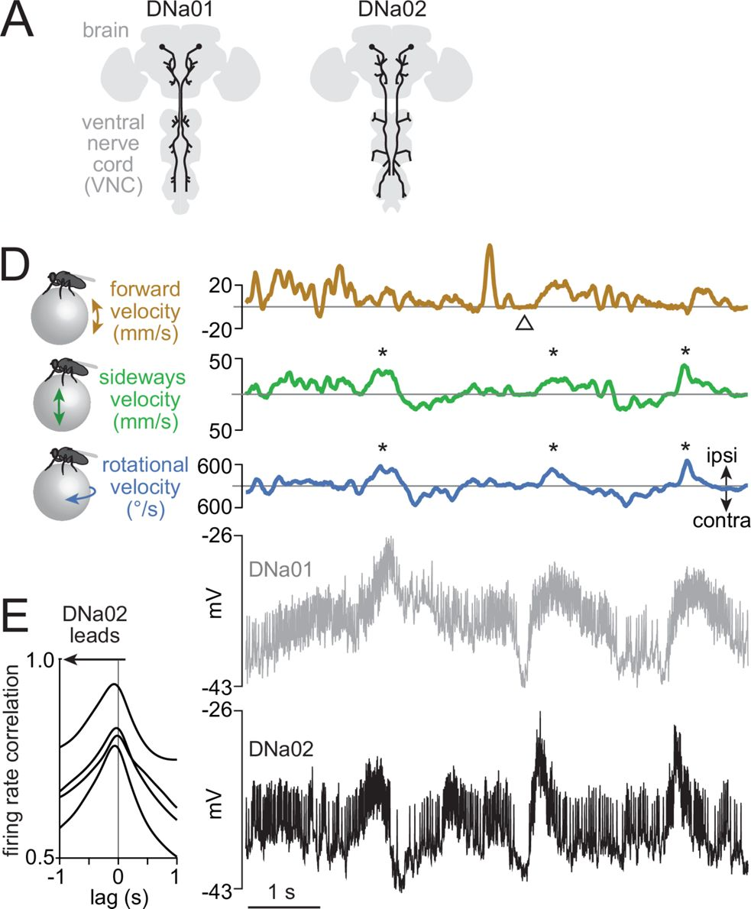

- Reading the figure (Rayshubskiy et al. 2025, eLife, Fig 1)
  - Panel A: one DNa01 and one DNa02 drawn in the CNS outline. Cell body and inputs in the brain, one axon down into the VNC
  - Panel D: a walking fly on a ball. Stars mark turns. Both neurons' voltage (bottom two traces) rises on every ipsilateral turn (blue rotational velocity trace)
  - Panel E: DNa02 leads the turn slightly, DNa01 follows. This is the fast vs slow distinction in the bullets above
  - This is exactly the signal we read out: left minus right DNa02 rate as the turn command
- Backward: MDN, the "moonwalker" neuron
  - Activate it and the fly walks backward
  - Silence it and the fly cannot back away from obstacles (Bidaye 2014)
- Stop
  - There is no single stop neuron
  - At least two separate mechanisms depending on context (Sapkal 2024)
    - One switches walking commands off
    - One actively brakes the legs
  - "Low DNp09" as the noop signal is a simplification
- What the data has
  - DNp09, DNa01, DNa02 as left/right pairs
  - MDN as 4 cells
  - All present and cleanly labelled
- Implementation sketch
  - After each brain window, read spike rates
  - Turn signal = rate(DNa02 right) - rate(DNa02 left)
    - Optionally add the DNa01 pair
  - Forward signal = rate(DNp09) - rate(MDN)
  - Pick the action with the largest signal
    - Noop when everything is below a floor
  - This is the zero-shot readout
  - The trained alternative replaces the hand-picked signals with a learned linear layer over all 1,314 DN rates
- Important caveat
  - None of this DN mapping has been validated in the Shiu simulation model we are copying
  - Shiu only validated the feeding pathway below
  - The DN mapping comes from optogenetics on real flies plus hobby projects

## "Do": interact with the thing in front

- Two candidate circuits, both about acting on something in front of the fly
- Feeding
  - Sugar-taste neurons on the mouthparts connect through the SEZ to MN9
  - MN9 is the motor neuron that extends the proboscis
  - The one pathway the Shiu model was actually calibrated on
    - 100 Hz sugar input gives about 80% of max MN9 firing
  - MN9 exists in our data as 2 cells

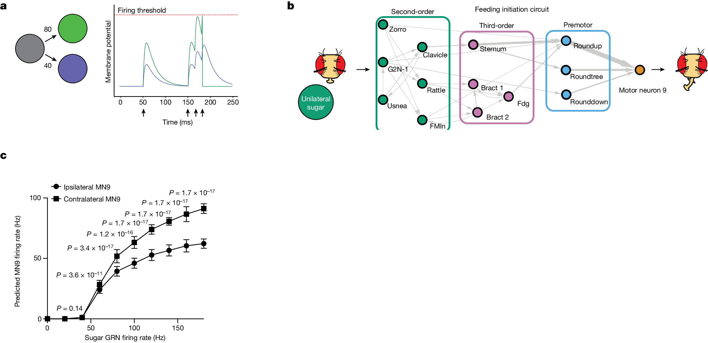

- Reading the figure (Shiu et al. 2024, Nature, Fig 1)
  - Panel a: the LIF model in one picture. A grey neuron with 80 synapses onto green and 40 onto blue. Each grey spike (arrows) bumps green twice as hard as blue. Three close spikes push green over threshold, blue never gets there
  - Panel b: the feeding circuit the model discovered. Sugar taste neurons, three layers of interneurons, then MN9 which extends the proboscis. This is the only pathway the model was validated on
  - Panel c: the calibration curve. Drive sugar neurons at X Hz, read MN9 rate. Contralateral MN9 responds more than ipsilateral. Our port must reproduce this curve
  - Panels d to h are screening results, ignore

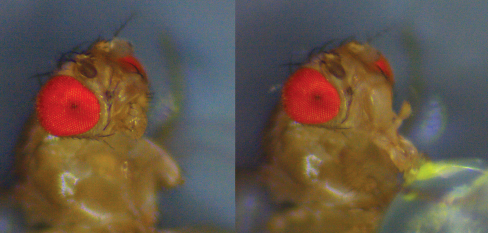

- Left: resting. Right: proboscis extended toward a sugar drop, the behaviour MN9 drives (Wikimedia Commons, CC BY-SA)
- Aggression / lunge
  - The spec named pC1 and aIP-g
  - Correction from the literature
    - aIPg and pC1d are the female aggression circuit (Schretter 2020)
    - In males, attack runs through P1/pC1 neurons and "MAP" neurons (Hoopfer 2015, Chiu 2021)
    - Our dataset is a male fly
- What the data has
  - 49 pC1 subtypes (156 neurons)
  - 14 aIPg subtypes (56 neurons)
  - No single clean "attack" label
- Implementation sketch
  - "Do" fires when MN9 rate exceeds a floor
    - Optionally also the attack population rate
  - In Craftax the same button eats, drinks, hits, and chops
    - So one output channel covers all of them

## Why this is a strong simplification

- No body
  - Real DN commands go into a VNC full of pattern generators that produce coordinated stepping
  - We read DNs as discrete actions instead
- No neuromodulation
  - Hunger, arousal, and sleep pressure in a real fly reconfigure circuits chemically over minutes
  - We inject them as fast spikes at one cell type
- No baseline activity
  - The Shiu model is silent unless driven
  - Inhibition only shows up where something is already firing
- Net position
  - We use the connectome for its wiring and weights
  - The I/O mapping is an engineering choice informed by biology
  - Not a claim of biological faithfulness

## Open questions for spec

- Colour: R8 alone (planned) or an R7 vs R8 comparison?
- Hunger: NPF (2 cells, planned) or a broader population?
- Thirst: which proxy, given no water-taste label exists in the data?
- Fatigue: FB6/FB7 tangentials (planned "dFB", unclear which), ER5 (clean, upstream), or both?
- Turn: fuse DNa01 and DNa02 into one left-minus-right signal, or keep them separate?
- Do: feeding pathway only, or also aggression, and if aggression, which male types?
- (unverified) items
  - Exact Wu 2003 NPF citation
  - Schnaitmann eLife year
  - Whether ppk28's lifespan role matters here
  - D-serine circuit position
