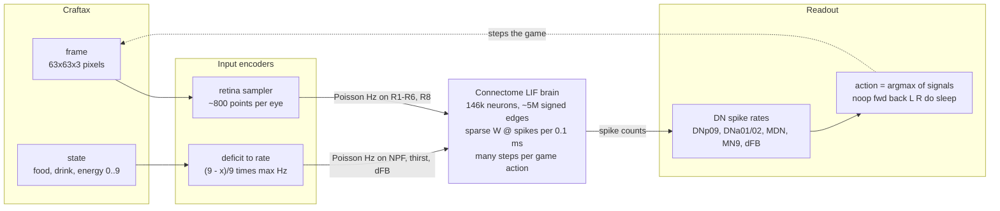
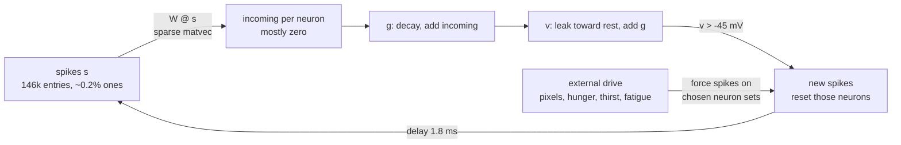

# Bio background (DRAFT, distilled for a non-biologist)

- Plain-language version. Fully cited version is in git history (commit c1c684b)
- Image sources in `img/SOURCES.md`

## The fly brain in one minute

- Size
  - About 140k neurons in the brain
  - Another ~20k in the ventral nerve cord (VNC), the fly's spinal cord
    - Runs the legs and wings. We drop it, since a gridworld has no legs
- Two brain regions matter for us
  - Optic lobes: two big visual processing blocks, one per eye, about 60% of all brain neurons
  - Central brain: everything else, plus the command neurons that tell the body what to do
- A connectome is a wiring diagram
  - For every neuron: which other neurons it connects to, and with how many synapses
  - A synapse is a contact point where one neuron pushes on another
    - More synapses between a pair means a stronger connection
  - Each neuron releases one main chemical, its neurotransmitter, which sets whether it excites or inhibits its targets
    - Excitatory: acetylcholine
    - Inhibitory: GABA, glutamate, histamine
    - Neuromodulators (dopamine, serotonin, octopamine): act over seconds to minutes, our model cannot represent this, under 1% of neurons

- How the pictures map to our model
  - The spike travelling down the axon is our binary $s_j = 1$, and the axon gives the 1.8 ms delay
  - Neurotransmitter release plus receptor binding collapses to one number: add $w_{ji}$ to the target's $g_i$
  - Sign of $w_{ji}$ comes from the sender's neurotransmitter, magnitude from the synapse count
- Descending neurons (DNs)
  - The ~1,300 neurons whose axons leave the brain and go down into the VNC
  - The brain's only way of commanding movement

- Namiki et al. 2018. Panel A: CNS (yellow) in the body. Panel B: optic lobes flanking the central brain, VNC below (labelled VNS), and one descending neuron in green running from brain to VNC
  - We keep everything above the neck and cut everything below
- Cell types
  - A named group of neurons with the same shape and wiring, usually a mirrored left/right pair or a small population
  - Names like DNp09 or MDN are cell types. The connectome data labels every neuron with its type, which is how we find them

## How the wiring diagram becomes a running brain

- This is the Shiu et al. 2024 recipe we are copying. Full details in `brain_model.md`

- Zero-shot loop. The trained variant swaps the readout for a linear layer over all 1,314 DNs

### One neuron

- Each neuron is a single number: its voltage $v$
  - Leaks toward a rest value of -52 mV
  - When it crosses -45 mV it "spikes", resets to -52 mV, and is frozen for 2.2 ms
- Each neuron also has an input accumulator $g$
  - Decays with a 5 ms time constant
  - A spike from neuron $j$ adds $w_{ji}$ to the $g$ of every target $i$, 1.8 ms later

$$
\begin{aligned}
\frac{dv_i}{dt} &= \frac{g_i - (v_i - v_{\text{rest}})}{20\ \text{ms}} \\
\frac{dg_i}{dt} &= -\frac{g_i}{5\ \text{ms}} \\
g_i &\leftarrow g_i + w_{ji} \quad \text{when } j \text{ spikes}
\end{aligned}
$$

- Reading the trace
  - Each input spike adds 6.9 mV to $g$, which decays over ~5 ms. $v$ integrates it slowly (20 ms), so one spike is not enough
  - A burst of close spikes (150 to 170 ms) pushes $v$ over threshold. It fires once, resets, and is frozen 2.2 ms
  - A strong edge at 100 Hz fires the target once in 300 ms. This is why the brain is quiet unless driven hard
  - Generated by `img/make_diagrams.py`

### Weights

- The weight is just the connectome
  - $w_{ji} = s_j \cdot n_{ji} \cdot 0.275\ \text{mV}$
  - $n_{ji}$ is the synapse count from $j$ to $i$, $s_j = \pm 1$ is the sender's sign
  - 0.275 mV is the one free constant in the whole model
- Scale intuition: gap from rest to threshold is 7 mV, so about 25 simultaneous synapses fire a resting neuron

### The whole brain

- Not a layered network
  - An MLP is a chain of layers, each with its own weight matrix
  - A brain has no layers: any neuron can connect to any other, including loops back
  - So we use one adjacency matrix $W$ over all 146k neurons
    - $W_{ij}$ is the weight from neuron $j$ (column) to neuron $i$ (row)
    - Zero when not connected, which is 99.99% of entries
    - A few million non-zeros total
  - Closest ML analogy: an RNN with a fixed, untrained weight matrix
    - Hidden state is $(v, g)$ per neuron
    - Run for thousands of timesteps, not one forward pass

- Toy example, 4 neurons
  - A excites B (3 synapses) and C (2 synapses)
  - B excites D (4 synapses), C inhibits D (5 synapses)
  - Suppose only A spiked this step

$$
W = \begin{pmatrix}
0 & 0 & 0 & 0 \\
3 & 0 & 0 & 0 \\
2 & 0 & 0 & 0 \\
0 & 4 & -5 & 0
\end{pmatrix},
\qquad
s = \begin{pmatrix} 1 \\ 0 \\ 0 \\ 0 \end{pmatrix},
\qquad
W s = \begin{pmatrix} 0 \\ 3 \\ 2 \\ 0 \end{pmatrix}
$$

- Reading the toy example
  - B receives +3, C receives +2, D receives nothing this step
  - If B and C later spike together, D receives $4 - 5 = -1$
    - C's inhibition only matters because B is also active
    - If B were silent, D would sit at zero regardless of C

- One timestep, for real
  - $s_t$ is the spike vector: 1 where a neuron fired this step, else 0
    - Almost all zeros, typically a few hundred ones out of 146k
  - $W s_{t-18}$ is the incoming input to every neuron
    - Row $i$ sums the weights from neurons that spiked 18 steps ago
    - 18 steps is the 1.8 ms axon delay at $dt = 0.1$ ms
    - Zero for most neurons, since none of their partners fired
  - Driven neurons (photoreceptors, hunger cells) bypass all this: we simply set $s_t = 1$ with probability rate times $dt$

$$
\begin{aligned}
\text{in}_t &= W\, s_{t-18} \\
v_t &= v_{\text{rest}} + b\,(v_{t-1} - v_{\text{rest}}) + c\, g_{t-1} \\
g_t &= a\, g_{t-1} + \text{in}_t \\
s_t &= \big[\, v_t > v_{\text{th}} \,\big] \\
v_t, g_t &\leftarrow v_{\text{rest}},\ 0 \quad \text{where } s_t = 1
\end{aligned}
$$

- Reading the update
  - $a = e^{-dt/5}$, $b = e^{-dt/20}$, $c = (b - a)/3$ are three constants from the time constants
  - Everything except $W s$ is elementwise, so the sparse matvec is the whole cost

- There is no background activity
  - Nothing fires unless we drive it
  - Inhibition therefore has no effect on a silent neuron (see D in the toy example)

### Input and output

- Input: pick a set of neurons and make them fire randomly at a chosen rate (Poisson spikes at, say, 100 Hz)
  - The paper's whole input vocabulary is "this cell type at this many Hz"
- Output: count spikes of a chosen set over a time window, convert to Hz
- Every I/O channel below is a fixed list of neuron indices plus either a rate we set (input) or a count we read (output)

## Vision: pixels in

- Each dome is one ommatidium, one pixel of the fly's image

- Kind et al. 2021. Panel B: inside one ommatidium, R1-R6 (green) stop in the lamina, R7 and R8 pass through to the medulla. Panel C: the medulla face-on, one dot per column, about 800 to 900 per eye
  - This hex grid is what our retina sampler has to map pixels onto
  - Light blue dots are pale columns, yellow are yellow. Ignore the red dorsal rim and the aMe12 legend entries
- Eye structure
  - Each eye is a hexagonal grid of about 800 lenses (ommatidia), 8 photoreceptors behind each
    - R1-R6: respond to overall brightness, feed motion detection. A greyscale camera
    - R7 and R8: colour. R7 sees UV, R8 sees blue or green depending on the ommatidium's pale or yellow flavour
    - Colour vision comes from comparing R7 against R8, so using R8 alone is a simplification
  - All photoreceptors are inhibitory (histamine). Light makes them fire, which suppresses the next layer. The connectome signs handle this
- What the data has
  - R1-R6 is one pooled label (3,377 cells). R7 and R8 are split by flavour: R7p, R7y, R8p, R8y
  - Photoreceptors carry no eye-position coordinates, so which lens each belongs to must be inferred from what it connects to
- Mapping for us
  - Sample the game frame at ~800 points per eye, one per lens
  - Brightness at a point sets the Poisson rate of that lens's R1-R6 cells, colour sets the R8 rate
  - Which pixels map to which lens is the retina geometry decision, still open

## Internal state: hunger, thirst, fatigue in

- These are the "how am I feeling" signals. In a real fly they come from body sensors we do not have, so we inject them into brain neurons that normally carry the signal
- Implementation: Craftax exposes food, drink, energy as integers 0 to 9. Map deficit to a rate, e.g. hunger rate = (9 - food) / 9 times max Hz, and drive the chosen cell type at that rate

### Hunger

- NPF neurons release a peptide that acts as a hunger broadcast
  - Activating them in a fed fly makes it behave as if starved: chases food cues, accepts worse food (Krashes 2009)
- Catch: NPF works by slow chemical release, not fast synapses. We are using its wiring as a proxy
- What the data has: only 2 NPF neurons (plus 2 related DNs). Hunger through NPF is a 2-cell channel

### Thirst

- ppk28 neurons are water-taste sensors on the mouthparts and legs
  - Activating them makes a fly extend its proboscis and drink, even with no water present (Cameron 2010)
- What the data has: no ppk28 or water label at all
  - Only 275 head taste neurons survive the VNC cut, labelled by body part, not by what they taste
  - Nearest proxies: humidity-sensing neurons (66 cells) or a hand-picked mouthpart taste type

### Fatigue and sleep

- Flies sleep. Sleep pressure builds while awake and is tracked in the central complex, the fly's navigation and state hub

- Hulse et al. 2021. Panel A: the central complex (CX, blue) sits dead centre in the brain. Panel C: its parts. EB (red ring) holds the ER5 sleep counter, FB (blue) is the "dFB" structure
- dFB neurons (dorsal fan-shaped body)
  - The textbook sleep switch: activate them and the fly sleeps (Donlea 2011, 2014)
  - Sleep here is a state, not a movement, which is why the spec maps sleep to dFB activity rather than to a DN
  - Catch: the classic experiments were later shown to be contaminated by unrelated VNC neurons (De 2023). dFB does still promote sleep but needs stronger drive than thought (Jones 2025)
- ER5 ring neurons in the ellipsoid body are the sleep-pressure counter upstream of dFB. Firing rises with time awake. Better characterised than dFB
- What the data has
  - No "dFB" label. The dorsal FB layers are FB6 and FB7 (140 neurons, 43 types), with no marker for which are the sleep ones
  - ER5 exists as a clean 21-neuron type

## Movement: actions out

- The fly cannot move directly from the brain. It sets DN activity and the VNC turns that into leg movements. We skip the VNC and read DN activity as the action
- Forward: DNp09. Activating it makes the fly walk forward (Bidaye 2020)
- Turn: DNa02 and DNa01
  - Each side's neuron drives a turn toward that side. Left-minus-right firing predicts how fast the fly rotates
  - DNa02: quick turns, direct input from the heading-versus-goal comparison in the navigation hub
  - DNa01: slower, sustained turns (Rayshubskiy 2024)

- Rayshubskiy et al. 2025. Panel A: one DNa01 and one DNa02, cell body in the brain, axon down into the VNC. Panel D: a fly walking on a ball, both neurons' voltage rises at every turn (stars). Panel E: DNa02 fires slightly before DNa01
- Backward: MDN, the "moonwalker" neuron. Activate it and the fly walks backward (Bidaye 2014)
- Stop: there is no single stop neuron. Stopping uses at least two context-dependent mechanisms (Sapkal 2024). "Low DNp09" as noop is a simplification
- What the data has: DNp09, DNa01, DNa02 as left/right pairs, MDN as 4 cells. All cleanly labelled
- Implementation sketch
  - After each brain window, read spike rates
  - Turn signal = rate(DNa02 right) - rate(DNa02 left). Forward signal = rate(DNp09) - rate(MDN)
  - Pick the action with the largest signal, noop when all are below a floor
  - The trained alternative replaces the hand-picked signals with a learned linear layer over all 1,314 DN rates
- Caveat: none of these locomotion DNs were tested in the Shiu model. Shiu tested feeding and grooming circuits and deliberately avoided DNs. The DN mapping comes from optogenetics on real flies plus hobby projects

## "Do": interact with the thing in front

- Feeding
  - Sugar-taste neurons on the mouthparts connect through the SEZ to MN9, the motor neuron that extends the proboscis
  - This is the pathway the Shiu model's one free constant was calibrated on: 100 Hz sugar input gives about 80% of max MN9 firing
  - MN9 exists in our data as 2 cells

- Shiu et al. 2024, Fig 1. Panel a: the LIF model in one picture, a grey neuron with 80 synapses onto green and 40 onto blue, three close spikes fire green and never blue. Panel b: sugar neurons, three layers of interneurons, then MN9. Panel c: the calibration curve our port must reproduce

- Left: resting. Right: proboscis extended toward a sugar drop, the behaviour MN9 drives
- Aggression / lunge
  - The spec named pC1 and aIP-g, but those are the female aggression circuit (Schretter 2020). Male attack runs through P1/pC1 and MAP neurons (Hoopfer 2015, Chiu 2021). Our dataset is a male fly
  - What the data has: 49 pC1 subtypes (156 neurons), 14 aIPg subtypes (56 neurons), no single clean "attack" label
- Implementation sketch: "do" fires when MN9 rate exceeds a floor. In Craftax the same button eats, drinks, hits, and chops, so one channel covers all of them

## Why this is a strong simplification

- No body: real DN commands go into a VNC full of pattern generators. We read DNs as discrete actions instead
- No neuromodulation: hunger, arousal, and sleep pressure reconfigure real circuits chemically over minutes. We inject them as fast spikes at one cell type
- No baseline activity: the Shiu model is silent unless driven, so inhibition only shows up where something is already firing
- Net position: we use the connectome for its wiring and weights. The I/O mapping is an engineering choice informed by biology, not a claim of biological faithfulness

## Open questions for spec

- Colour: R8 alone (planned) or an R7 vs R8 comparison?
- Hunger: NPF (2 cells, planned) or a broader population?
- Thirst: which proxy, given no water-taste label exists in the data?
- Fatigue: FB6/FB7 tangentials (planned "dFB", unclear which), ER5 (clean, upstream), or both?
- Turn: fuse DNa01 and DNa02 into one left-minus-right signal, or keep them separate?
- Do: feeding pathway only, or also aggression, and if aggression, which male types?
